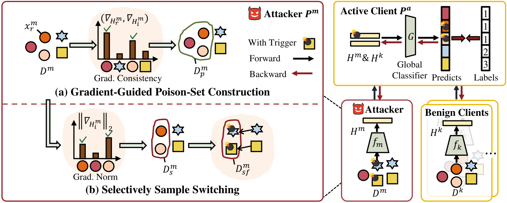

# Label-Free Backdoor Attacks in Vertical Federated Learning

**This workspace now focuses on the AVGuard anchor-based defense pipeline built on top of LFBA attack experiments.**



> [Label-Free Backdoor Attacks in Vertical Federated Learning](https://ojs.aaai.org/index.php/AAAI/article/view/34246)
>
> Wei Shen, Wenke Huang, Guancheng Wan, Mang Ye
>
> School of Computer Science, Wuhan University
>
> **Abstract** Vertical Federated Learning (VFL) involves multiple clients collaborating to train a global model with distributed features but shared samples. While it becomes a critical privacy-preserving learning paradigm, its security can be significantly compromised by backdoor attacks, where a malicious client injects a target backdoor by manipulating local data. Existing attack methods in VFL rely on the assumption that the malicious client can obtain additional knowledge about task labels, which is not applicable in VFL. In this work, we investigate a new backdoor attack paradigm in VFL, **L**abel-**F**ree **B**ackdoor **A**ttacks (**LFBA**), which does not require any additional label information and is feasible in VFL settings. Specifically, while existing methods assume access to task labels or target-class samples, we demonstrate that local embedding gradients reflect the semantic information of labels. It can guide the construction of the poison sample set from the backdoor target. Besides, we uncover that backdoor triggers tend to be ignored and under-fitted due to the learning of original features, which hinders backdoor task optimization. To address this, we propose selectively switching poison samples to disrupt feature learning, promoting backdoor task learning while maintaining accuracy on clean data. Extensive experiments demonstrate the effectiveness of our method in various settings.

## Requirements

We use a single NVIDIA GeForce RTX 3090 for all evaluations. Clone the repository and install the dependencies from `requirements.txt` using the Anaconda environment:

```bash
conda create -n LFBA python=3.9
conda activate LFBA
git clone 'https://github.com/shentt67/LFBA.git'
cd LFBA
pip install -r requirements.txt
```

## AVGuard Workflow

This workspace keeps only one integrated pipeline: `AVGuard`, the anchor-based three-stage vertical federated backdoor defense described in `纵向联邦后门防御方案实现指导大纲_含修改标记.md`.

The previous no-defense baseline branch and other legacy defense schemes have been removed. New experiments should use the staged configs under `configs/avguard/`.

Recommended stage-wise commands:

1. Stage 1 anchor pretraining

```bash
python main.py --config configs/avguard/phishing/stage1.json
```

2. Stage 2 joint training with anchor loss and EMA anchor calibration

```bash
python main.py --config configs/avguard/phishing/stage2.json
```

3. Stage 3 evaluation with effective-support detection and joint weighted correction

```bash
python main.py --config configs/avguard/phishing/stage3_test.json
```

For CIFAR10, use the configs under `configs/avguard/cifar10/`. For the processed IEEE-CIS Fraud dataset in this workspace, use `configs/avguard/ieee_cis_fraud/`.

Key arguments:

**--device:** The ID of GPU to be used.

**--dataset:** The experiment datasets. We include `['NUSWIDE', 'UCIHAR', 'PHISHING', 'CIFAR10', 'IEEE_CIS_FRAUD']` for evaluations.

**--epoch:** The training epochs.

**--batch_size:** The training batch size.

**--lr:** The learning rate.

**--attack:** The attack methods. Set `LFBA` for the proposed method.

**--anchor_idx:** The index of anchor.

For LFBA, the backdoor target label is inferred from the training sample at `anchor_idx`; current configs no longer set `target_label`.

**--poison_rate:** The poison ratio.

**--poison_dimensions:** The number of trigger dimensions on the attacker client.

**--select_rate:** The switching ratio.

**--lfba_poison_source:** LFBA poison-set source. Use `gradient` for the original label-free gradient inference, or `oracle_label` to directly expose all training samples that share the `anchor_idx` label and sample the poison set from that label pool according to `poison_rate`.

**--theta_supp:** Stage 3 valid-support threshold. A client counts as valid support for the global prediction only when its local anchor prediction agrees with the global output and its local confidence is at least `theta_supp`.

**--gamma:** Stage 3 joint-voting temperature. The default is `2.0`, and it scales the sample-level confidence term inside the `static reliability + dynamic confidence` weighting rule.

For the updated `PHISHING` dataset in this workspace, place the file at `dataset/data_raw/Phishing/PHISHING_full.csv`. The loader will automatically adapt to the new feature dimension.

For the processed `IEEE-CIS-Fraud` dataset in this workspace, place the files under `dataset/data_raw/processed/IEEE-CIS-Fraud/`:

- `X_balanced.npy`
- `y_balanced.npy`
- `feature_columns.csv` (optional but recommended)

The loader automatically supports `--dataset IEEE-CIS-Fraud`, `--dataset IEEE_CIS_FRAUD`, or `--dataset IEEECISFRAUD` and performs a deterministic stratified train/test split.

## Citation

Please cite our work, thank you!

```text
@inproceedings{shen2025label,
  title={Label-free backdoor attacks in vertical federated learning},
  author={Shen, Wei and Huang, Wenke and Wan, Guancheng and Ye, Mang},
  booktitle={The 39th AAAI Conference on Artificial Intelligence},
  year={2025}
}
```

Contact: [weishen@whu.edu.cn](mailto:weishen@whu.edu.cn)
